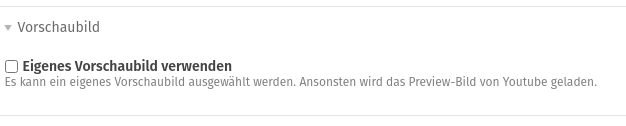
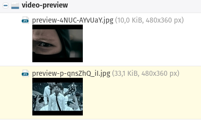
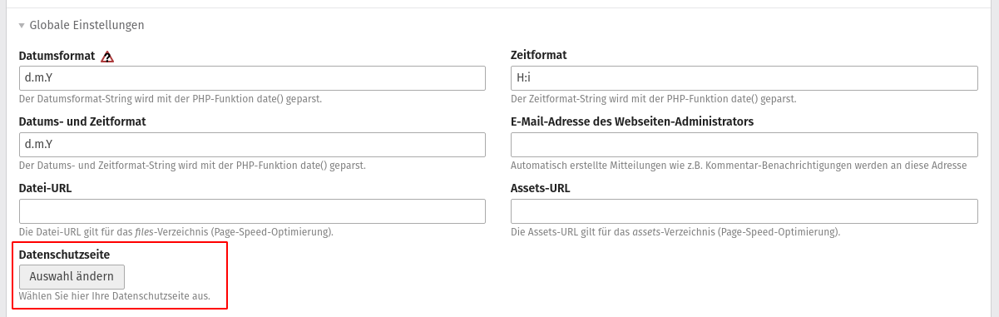
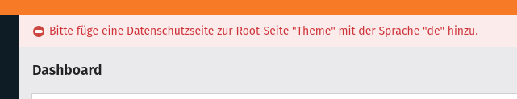

# Youtube-Bundle

Dieses Bundle erweitert das existierende Youtube-Element von Contao, damit das Vorschaubild von YouTube verwendet werden kann.

## Requirements

- PHP ab **7.3**
- Contao ab der Version **4.9**

## Installation

Am einfachsten lässt sich das Bundle per Composer installieren:

```shell script
composer require dreibein/contao-youtube-bundle
```

## Verwendung

### Backend

Im Youtube Element hat man nun die Möglichkeit zu wählen, ob ein eigenes Vorschaubild verwendet werden soll.
Möchte man kein eigenes Bild auswählen, wird dieses von YouTube geladen. Dazu muss die Checkbox nicht weiter beachtet werden.



Um das Bild von YouTube zu laden, wird mittels der YouTube-ID über die URL `https://img.youtube.com/vi/YOUTUBE-ID/hqdefault.jpg` dieses auf den Server geladen und im File-System abgelegt.
Falls unter `/files` das Verzeichnis **video-preview** noch nicht existiert, wird dieses automatisch angelegt und auf **öffentlich** gesellt.
Die Bilder werden dabei eindeutig mit `preview-YOUTUBE-ID.jpg` benannt.



Dadurch, dass im Frontend ein Link zur **Datenschutz-Seite** generiert wird, muss dieser im Backend hinterlegt werden.
Dies kann man bei der **Root-Seite** in der Seitenstruktur machen und das Modul gibt selbstständig den korrekten Link im Frontend aus.



Falls die Datenschutz-Seite nicht hinterlegt ist, wird dem User eine Fehlermeldung angezeigt.



### Frontend

Im Template verhält sich das Element nun so, dass zuerst das Vorschaubild mit einem Informationstext geladen wird.
In diesem Text wird darauf hingewiesen, dass beim Aktivieren des Elements Daten an YouTube übertragen werden.


Klickt der User auf den Link um den Inhalt zu aktivieren, wird im **Session-Storage** ein Eintrag gespeichert, sodass beim Neuladen der Seite die Abfrage nicht nochmal durchgeführt werden muss.
Bei der Zustimmung wird der Container mit dem Vorschaubild und dem Infotext per JavaScript entfernt und durch das **iFrame** des Videos ersetzt.
Des Weiteren findet das Laden der iFrames auch für alle weiteren YouTube-Elemente auf dieser Seite statt.

## Contribution

Bug reports and pull requests are very welcome.
